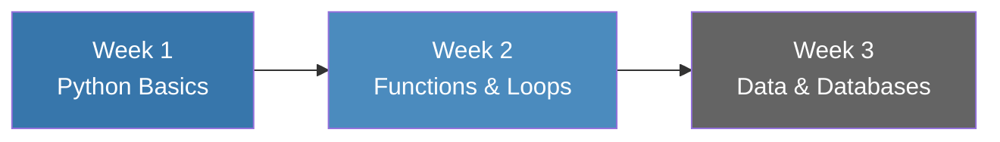
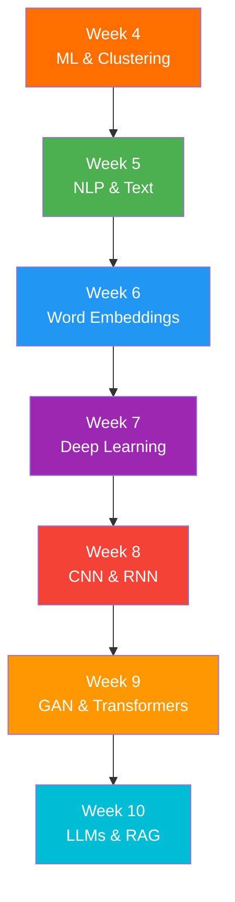

<div align="center">

# 🎓 INCO9X1: Introduction to Coding for Data Science

### University of Johannesburg | Master of Financial Engineering Programme

[](https://www.python.org/)
[](https://www.tensorflow.org/)
[](https://keras.io/)
[](https://pytorch.org/)
[](https://jupyter.org/)

[](./LICENSE)
[](./COURSE_OUTLINE.md)
[](./PROJECT_TOPICS.md)

---

### 🌟 *Empowering Future Financial Engineers with Cutting-Edge Data Science Skills*

</div>

---

## 📋 Table of Contents

- [Course Overview](#-course-overview)
- [Course Objectives](#-course-objectives)
- [Course Structure](#-course-structure)
- [Weekly Materials](#-weekly-materials)
- [Additional Resources](#-additional-resources)
- [Installation Guide](#-installation-guide)
- [Research Opportunities](#-research-opportunities)
- [Academic Integrity](#-academic-integrity)
- [Tools & Technologies](#-tools--technologies)
- [Contact Information](#-contact-information)

---

## 🎯 Course Overview

<div align="center">

```
┌─────────────────────────────────────────────────────────────────┐
│  From Python Fundamentals to Advanced AI & Deep Learning       │
│  ─────────────────────────────────────────────────────────────  │
│  📊 Data Science  •  🤖 Machine Learning  •  🧠 Deep Learning   │
│  💬 NLP  •  🔮 Transformers  •  🎨 GANs  •  🚀 LLMs & RAG       │
└─────────────────────────────────────────────────────────────────┘
```

</div>

This comprehensive course provides a rigorous foundation in **Python programming** and **data science** tailored specifically for **financial engineering** applications. Students progress from basic programming concepts to advanced topics including **deep learning**, **natural language processing**, and **generative AI**.

### 📊 Course Information

| **Aspect** | **Details** |
|------------|-------------|
| **Course Code** | INCO9X1 |
| **Level** | Master's (M.F.E.) |
| **Duration** | 10 Weeks |
| **Credits** | TBD |
| **Prerequisites** | Basic mathematics and statistics |
| **Assessment** | Projects (40%), Assignments, Exams |

---

## 🎯 Course Objectives

By the end of this course, students will be able to:

<table>
<tr>
<td width="50%">

### 💻 **Programming Foundations**
- ✅ Master Python programming fundamentals
- ✅ Implement functions, loops, and iterations
- ✅ Work with modules and packages
- ✅ Handle data structures efficiently

</td>
<td width="50%">

### 📊 **Data Science Skills**
- ✅ Perform data preprocessing and cleaning
- ✅ Build and query SQL/NoSQL databases
- ✅ Create compelling data visualizations
- ✅ Apply statistical analysis techniques

</td>
</tr>
<tr>
<td width="50%">

### 🤖 **Machine Learning**
- ✅ Implement supervised learning algorithms
- ✅ Apply unsupervised learning (clustering)
- ✅ Build predictive models
- ✅ Evaluate model performance

</td>
<td width="50%">

### 🧠 **Deep Learning & AI**
- ✅ Design and train neural networks (ANN, MLP)
- ✅ Implement CNNs and RNNs/LSTMs
- ✅ Work with GANs and Transformers
- ✅ Deploy LLMs and RAG systems

</td>
</tr>
</table>

---

## 📚 Course Structure

<div align="center">

### Part I: Introduction to Coding with Python
*Weeks 1-3 | Building Strong Foundations*

</div>



<div align="center">

### Part II: Python Data Science Applications
*Weeks 4-10 | Advanced Topics & Applications*

</div>



---

## 📖 Weekly Materials

<div align="center">

### 🗓️ Complete 10-Week Curriculum

</div>

| Week | Topic | 📊 Slides | 💻 Notebooks | 📄 Resources |
|:----:|-------|-----------|--------------|--------------|
| **1** | **Introduction to Python** | [Week1.ppt](./Week%201-%20Intro%20to%20Python%20List%20Tuples%20Ops/Week1.ppt) | - | - |
| **2** | **Functions, Loops & Modules** | [Functions Loops and Iterations.pptx](./Week%202%20-%20Functions%20Loops%20Iterations%20Modules/Functions%20Loops%20and%20Iterations.pptx)<br/>[Python MODULES for Data Analysis.pptx](./Week%202%20-%20Functions%20Loops%20Iterations%20Modules/Python%20MODULES%20for-Data-Analysis.pptx) | [Week 1-3 Introduction.ipynb](./Week%202%20-%20Functions%20Loops%20Iterations%20Modules/2025_WEEK%201%20to%203%20-%20INTRODUCTION%20TO%20PYTHON%20FOR%20DATA%20SCIENCE.ipynb) | [Salaries.csv](./Week%202%20-%20Functions%20Loops%20Iterations%20Modules/Salaries.csv)<br/>[flights.csv](./Week%202%20-%20Functions%20Loops%20Iterations%20Modules/flights.csv) |
| **3** | **Data Preprocessing & Databases** | [SESSION 5 DATABASES SQL NoSQL.pptx](./Week%203%20-%20Data%20Preprocessing%20and%20Database%20Building/SESSION%205_DATABASES_SQL_NoSQL.pptx) | [Week 4 Data Preprocessing.ipynb](./Week%203%20-%20Data%20Preprocessing%20and%20Database%20Building/2025__WEEK4SLIDES_DATA_PREPROCESSING_SPLIT_MODELLING_STEPS.ipynb)<br/>[Week 5 MySQL in Python.ipynb](./Week%203%20-%20Data%20Preprocessing%20and%20Database%20Building/Week%205-CREATE_MySQL_Table_within_Python_call_it_in_Pandas_DataFrame.ipynb) | - |
| **4** | **ML Algorithms & Clustering** | - | [Random Forest Classification.ipynb](./Week%204%20-%20Recap%20on%20ML%20Algos%20and%20Unsupervised%20Learning%20-Clustering%20K-Means/RANDOM-FOREST-CLASSIFICATION.ipynb)<br/>[Random Forest Regression.ipynb](./Week%204%20-%20Recap%20on%20ML%20Algos%20and%20Unsupervised%20Learning%20-Clustering%20K-Means/RANDOM-FOREST-REGRESSION.ipynb)<br/>[Ridge Regression.ipynb](./Week%204%20-%20Recap%20on%20ML%20Algos%20and%20Unsupervised%20Learning%20-Clustering%20K-Means/RIDE-REGRESSION.ipynb)<br/>[Unsupervised Learning.ipynb](./Week%204%20-%20Recap%20on%20ML%20Algos%20and%20Unsupervised%20Learning%20-Clustering%20K-Means/UNSUPERVISED_LEARNING_ALGOS_and_APPLICATIONSinFINANCE.ipynb) | - |
| **5** | **NLP & Text Vectorization** | - | [NLP Text Data Analysis.ipynb](./Week%205%20-%20Natural%20Langua%20Processing%20-Text%20Vect%20%26%20Topic%20Modelling/NLP_TextData_Analysis.ipynb) | - |
| **6** | **Word Embeddings** | [Word Embeddings.pptx](./Week%206%20-%20Word%20Embedding/Word-embeddings.pptx) | [Word Embeddings Slides.ipynb](./Week%206%20-%20Word%20Embedding/Slides_WORD_EMBEDDINGS.ipynb) | - |
| **7** | **Deep Learning: ANN & MLP** | [DL KERAS ON TENSORFLOW.pptx](./Week%207%20-%20Deep%20Learning%20ANN%20%26%20MLP%20on%20Keras%20and%20TensorFlow/DL%20ERAS%20ON%20TENSORFLOW.pptx) | [DL with Google News (1).ipynb](./Week%207%20-%20Deep%20Learning%20ANN%20%26%20MLP%20on%20Keras%20and%20TensorFlow/AI__DLwithGoogleNewsData_KERAS_Regression_Classification%20(1).ipynb)<br/>[DL with Google News (2).ipynb](./Week%207%20-%20Deep%20Learning%20ANN%20%26%20MLP%20on%20Keras%20and%20TensorFlow/AI__DLwithGoogleNewsData_KERAS_Regression_Classification%20(2).ipynb)<br/>[Multiclass DL MNIST.ipynb](./Week%207%20-%20Deep%20Learning%20ANN%20%26%20MLP%20on%20Keras%20and%20TensorFlow/AI__MULTICLASS_Deep_LearningWithMNISTdataKERAS.ipynb)<br/>[DL KERAS.ipynb](./Week%207%20-%20Deep%20Learning%20ANN%20%26%20MLP%20on%20Keras%20and%20TensorFlow/DL_KERAS.ipynb) | - |
| **8** | **Advanced NNs: CNN & RNN** | [CNN & RNN Models.pptx](./Week%208%20-%20Advanced%20Neural%20Networks%20%20CNN%20RNN%20Bayesian-Networks/CNN%20%26%20RNN%20Models-.pptx) | [CNN with MNIST.ipynb](./Week%208%20-%20Advanced%20Neural%20Networks%20%20CNN%20RNN%20Bayesian-Networks/AI__CNN_MNISTdata_Keras.ipynb)<br/>[LSTM Stock Prices.ipynb](./Week%208%20-%20Advanced%20Neural%20Networks%20%20CNN%20RNN%20Bayesian-Networks/LSTM%20for%20predicting%20stock%20prices.ipynb)<br/>[RNN-LSTM Stock Market.ipynb](./Week%208%20-%20Advanced%20Neural%20Networks%20%20CNN%20RNN%20Bayesian-Networks/RNN-LSTM%20for%20regression%20and%20Classification-%20stock%20market%20prediction.ipynb)<br/>[RNN Template.ipynb](./Week%208%20-%20Advanced%20Neural%20Networks%20%20CNN%20RNN%20Bayesian-Networks/RNN_%20just%20add%20data%20link.ipynb) | - |
| **9** | **GANs & Transformers** | [GAN Network Model.pptx](./Week%209%20-%20Advanced%20Neural%20Networks%20-%20GAN%20Transformers/GAN%20Network%20Model.pptx)<br/>[TRANSFORMERS NETWORK.pptx](./Week%209%20-%20Advanced%20Neural%20Networks%20-%20GAN%20Transformers/TRANSFORMERS%20NETWORK.pptx) | - | - |
| **10** | **LLMs & RAG Systems** | [Large Language Models.pptx](./Week%2010%20Generative%20Pretrained%20Transformers%20-%20LLMs%20%26%20RAG/Large%20Language%20Models.pptx) | - | [Getting Started with Ollama.docx](./Week%2010%20Generative%20Pretrained%20Transformers%20-%20LLMs%20%26%20RAG/Getting%20Started%20with%20Ollama.docx) |

---

## 📚 Additional Resources

<div align="center">

| 📄 Resource | 📝 Description |
|-------------|----------------|
| [**📖 COURSE_DESCRIPTION.md**](./COURSE_DESCRIPTION.md) | Detailed course description and learning outcomes |
| [**📅 COURSE_OUTLINE.md**](./COURSE_OUTLINE.md) | Complete weekly syllabus and schedule |
| [**⚙️ INSTALLATION_GUIDE.md**](./INSTALLATION_GUIDE.md) | Setup instructions for Python, R, and required tools |
| [**🎯 PROJECT_TOPICS.md**](./PROJECT_TOPICS.md) | **22 Advanced Data Science Project Topics for 2026** |
| [**📚 RECOMMENDED_READINGS.md**](./RECOMMENDED_READINGS.md) | Textbooks, papers, and supplementary materials |
| [**🔬 RESEARCH_OPPORTUNITIES.md**](./RESEARCH_OPPORTUNITIES.md) | Dissertation topics and research directions |

</div>

---

## 🛠️ Installation Guide

### Python Installation via Anaconda (Recommended)

<div align="center">

[](https://www.anaconda.com/)

</div>

Python stands out as a potent, adaptable, and easily grasped programming language, renowned for its applicability across diverse domains such as **Econometrics**, **Mathematics**, **Statistics**, **Engineering**, **Big Data analytics**, and **Data Science**.

#### 📥 Installation Steps:

1. Visit [https://www.anaconda.com/](https://www.anaconda.com/)
2. Click on "**Free Download**"
3. Select the appropriate package for your operating system
4. Python and all required modules will automatically be installed
5. Launch Python through:
   - 🖥️ Anaconda Navigator
   - 💻 Anaconda Prompt
   - 🔧 IDEs: Spyder, PyCharm, Jupyter Notebook

> **⚠️ Important:** Python 2.x is obsolete. This course uses **Python 3.12+**

For detailed installation instructions, see [**INSTALLATION_GUIDE.md**](./INSTALLATION_GUIDE.md)

---

## 📖 Recommended Readings

### Core Textbooks

1. **Speight, A.** (2020). *Bite-size Python: An Introduction to Python Programming*. Wiley. ISBN: 978-1-119-64381-4

2. **McKinney, W.** (2017). *Python for Data Analysis*, 2nd edition. O'Reilly Media.

3. **Nelli, F.** (2015). *Python Data Analytics - Data Analysis and Science Using Pandas, Matplotlib, and the Python Programming Language*. Apress. ISBN: 978-1-4842-0959-2

4. **Rafail, P. & Freitas, I.** (2020). *Natural Language Processing*. Online ISBN: 9781529749120

5. **Sundnes, J.** (2020). *Introduction to Scientific Programming with Python*. Simula Springer Briefs on Computing. ISBN: 978-3-030-50356-7

6. **Ramakrishnan, R. & Gehrke, J.** (2002). *Database Management Systems*, 3rd edition. McGraw Hill.

📚 For complete bibliography, see [**RECOMMENDED_READINGS.md**](./RECOMMENDED_READINGS.md)

---

## 🔬 Research Opportunities

### 🎯 Data Science Projects 2026

<div align="center">

**22 Advanced Project Topics Covering:**

</div>

<table>
<tr>
<td width="50%">

#### 🗄️ **Database & Pipelines**
- Real-Time Financial Market Database System

#### 📊 **Clustering & ML**
- JSE Stock Clustering for Portfolio Construction
- Credit Risk Segmentation
- Cryptocurrency Market Segmentation

#### 💬 **NLP & Text Analytics**
- Topic Modeling of JSE Annual Reports
- SARB Monetary Policy Sentiment Analysis
- News-Based Alpha Extraction

</td>
<td width="50%">

#### 🧠 **Deep Learning**
- Credit Default Prediction with ANNs
- Options Pricing Using Neural Networks
- Candlestick Pattern Recognition with CNNs

#### 🔮 **Advanced AI**
- USD/ZAR Forecasting with LSTMs
- Synthetic Market Scenarios with GANs
- Transformer-Based Stock Prediction

#### 🚀 **LLMs & Agents**
- RAG System for Financial Research
- Autonomous Trading Agent with LLMs

</td>
</tr>
</table>

**📄 Full project descriptions available in:** [**PROJECT_TOPICS.md**](./PROJECT_TOPICS.md)

### 📝 Dissertation Topics

This course provides foundation for various dissertation topics:

- 📈 Stock market predictions using advanced neural networks
- 🔍 Fraud detection in financial statements
- 💼 Portfolio optimization with sentiment analysis
- 💳 Credit risk assessment with text data
- 📰 Event-driven investing strategies
- 📱 Social media analytics for stock prediction

**📋 Full list available in:** [**RESEARCH_OPPORTUNITIES.md**](./RESEARCH_OPPORTUNITIES.md)

---

## ⚖️ Academic Integrity

### 🤖 Use of Generative AI

<div align="center">

[](./PROJECT_TOPICS.md)

</div>

The use of Generative AI tools (e.g., **ChatGPT**, **Claude**, **GitHub Copilot**) is **✅ PERMITTED** in this course; however:

> **⚠️ MANDATORY DISCLOSURE REQUIRED**
> 
> - You **MUST** explicitly acknowledge any use of Generative AI in your work
> - **Failure to disclose** will result in **disqualification** and a grade of **0** for the assignment
> - Document how AI was used (ideation, debugging, code generation, etc.)
> - AI detection tools are regularly used to verify compliance

This policy ensures **transparency** while embracing modern tools in data science education.

---

## 🛠️ Tools & Technologies

<div align="center">

### Programming Languages

[](https://www.python.org/)
[](https://www.r-project.org/)
[](https://www.mysql.com/)

### Development Environments

[](https://jupyter.org/)
[](https://www.spyder-ide.org/)
[](https://www.jetbrains.com/pycharm/)
[](https://www.anaconda.com/)

### Key Libraries

</div>

| Category | Libraries |
|----------|-----------|
| **📊 Data Manipulation** | `pandas`, `numpy` |
| **📈 Visualization** | `matplotlib`, `seaborn`, `plotly` |
| **🤖 Machine Learning** | `scikit-learn` |
| **💬 NLP** | `nltk`, `spacy`, `gensim` |
| **🧠 Deep Learning** | `tensorflow`, `keras`, `pytorch` |
| **🗄️ Database** | `sqlalchemy`, `pymongo` |

<div align="center">

### Frameworks & Technologies

[](https://www.tensorflow.org/)
[](https://keras.io/)
[](https://pytorch.org/)
[](https://scikit-learn.org/)
[](https://www.mysql.com/)
[](https://www.mongodb.com/)

</div>

---

## 📞 Contact Information

<div align="center">

### 👨‍🏫 Instructor

**Prof. John Weirstrass Muteba Mwamba, Ph.D.**

[](mailto:johnmu@uj.ac.za)
[](mailto:jwmm@yorku.ac.za)
[](https://wa.me/12892370366)
[](tel:+27115594371)

[](https://scholar.google.com/citations?user=YOUR_ID)
[](https://orcid.org/YOUR_ORCID)

</div>

---

## 📜 License

This repository is maintained for academic purposes by **Dr. John Weirstrass Muteba Mwamba**. Materials are provided for educational use by students and researchers.

See [**LICENSE**](./LICENSE) for more information.

---

<div align="center">

## 🌟 Acknowledgments

*Special thanks to all students and researchers contributing to the advancement of financial engineering education.*

---

### 🎓 **John Weirstrass MUTEBA MWAMBA, Ph.D.**

*Inspiring Excellence in Financial Engineering Education*

---

**© 2026 Analytics Research Group. All Rights Reserved.**

<br/>

[](https://github.com/johnmuteba)
[](https://www.uj.ac.za/)

</div>
